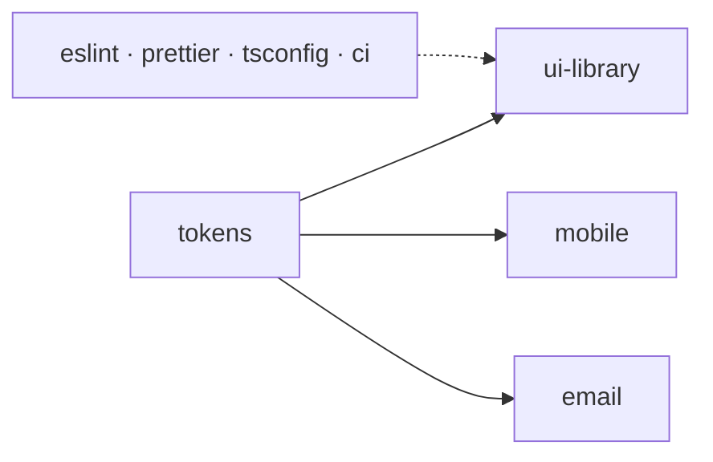

Cada paquete vive en su repositorio (`inzumer-<nombre>`) y se publica en npm como
`@inzumer/<nombre>`, con [Changesets](/practicas/releases/). En el diagrama, cada nombre lleva ese
prefijo.

| Paquete                                        | Para qué                                            |
| ---------------------------------------------- | --------------------------------------------------- |
| [`@inzumer/tokens`](/paquetes/tokens/)         | Colores, tipografía, espaciado y preset de Tailwind |
| [`@inzumer/ui-library`](/paquetes/ui-library/) | Componentes React para la web                       |
| [Librería mobile](/paquetes/ui-native/)        | Componentes React Native (Expo)                     |
| [`@inzumer/email`](/paquetes/email/)           | Componentes y plantillas de mails                   |
| [`@inzumer/eslint`](/paquetes/eslint/)         | Reglas de ESLint compartidas                        |
| [`@inzumer/prettier`](/paquetes/prettier/)     | Formato y orden de imports                          |
| [`@inzumer/tsconfig`](/paquetes/tsconfig/)     | Configuraciones de TypeScript                       |
| [`@inzumer/ci`](/paquetes/ci/)                 | Workflows de GitHub Actions reutilizables           |

La línea punteada son las herramientas de desarrollo: las usan todos los repos, no solo la librería
web. Cómo combinarlos en un proyecto nuevo está en [Armar un proyecto](/practicas/nuevo-proyecto/).

## Storybooks

- Componentes web: [ui-web.inzumer.com](https://ui-web.inzumer.com)
- Componentes de mails: [ui-emails.inzumer.com](https://ui-emails.inzumer.com)
- Componentes mobile: [ui-native.inzumer.com](https://ui-native.inzumer.com)
