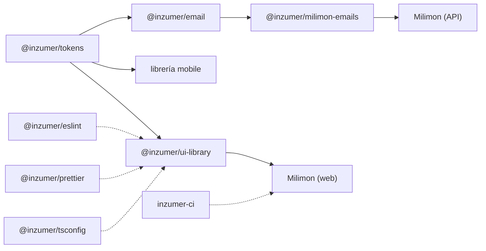

Cada paquete vive en su repositorio (`inzumer-<nombre>`) y se publica en npm como
`@inzumer/<nombre>`, con [Changesets](/practicas/releases/).

| Paquete                                        | Para qué                                            | Storybook                                              |
| ---------------------------------------------- | --------------------------------------------------- | ------------------------------------------------------ |
| [`@inzumer/tokens`](/paquetes/tokens/)         | Colores, tipografía, espaciado y preset de Tailwind | —                                                      |
| [`@inzumer/ui-library`](/paquetes/ui-library/) | Componentes React para la web                       | [ui-web.inzumer.com](https://ui-web.inzumer.com)       |
| [Librería mobile](/paquetes/ui-native/)        | Componentes React Native (Expo)                     | [ui-native.inzumer.com](https://ui-native.inzumer.com) |
| [`@inzumer/email`](/paquetes/email/)           | Componentes y plantillas de mails                   | [ui-emails.inzumer.com](https://ui-emails.inzumer.com) |
| [`@inzumer/eslint`](/paquetes/eslint/)         | Reglas de ESLint compartidas                        | —                                                      |
| [`@inzumer/prettier`](/paquetes/prettier/)     | Formato y orden de imports                          | —                                                      |
| [`@inzumer/tsconfig`](/paquetes/tsconfig/)     | Configuraciones de TypeScript                       | —                                                      |
| [`inzumer-ci`](/paquetes/ci/)                  | Workflows de GitHub Actions reutilizables           | —                                                      |

Las líneas punteadas son herramientas de desarrollo: todos los repos las usan, no solo los que
aparecen en el diagrama.
